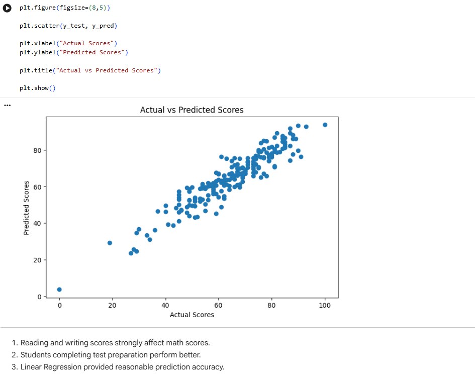
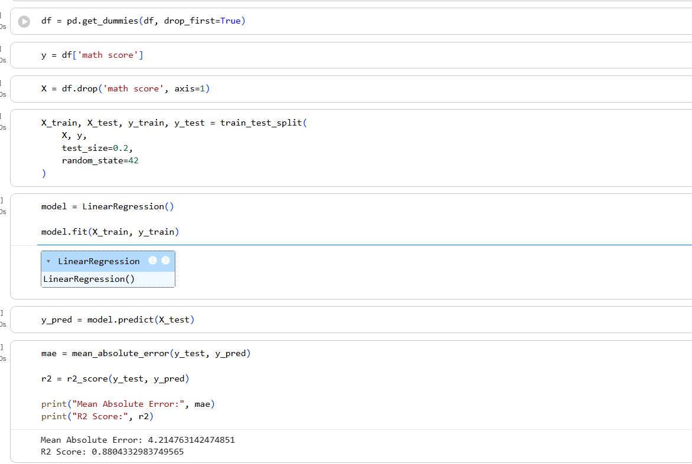

# Student Performance Prediction Internship Project

## Project Title
Student Performance Prediction using Linear Regression

## 🌐 Live Application

**GradePulse Dashboard:** https://gradepulse.streamlit.app/

## Problem Statement
Educational institutions need to predict student performance to identify learners who may require additional support. This project analyzes student data and uses regression to forecast exam scores.

## Objective
- Analyze the student performance dataset
- Build a predictive model for student scores
- Visualize actual vs predicted results
- Provide insights for supporting student success

## Dataset Information
- Dataset name: `StudentsPerformance.csv`
- Description: Student demographic and exam score records
- Main columns:
  - `gender`
  - `race/ethnicity`
  - `parental level of education`
  - `lunch`
  - `test preparation course`
  - `math score`
  - `reading score`
  - `writing score`

## Technologies Used
- Python
- Jupyter Notebook
- Pandas
- NumPy
- Scikit-learn
- Matplotlib
- Seaborn

## Workflow
1. Load and inspect the dataset
2. Clean and preprocess data
3. Select important features for prediction
4. Train a linear regression model
5. Evaluate model performance
6. Visualize actual vs predicted scores
7. Derive actionable education insights

## Model Explanation
Linear Regression is a statistical method that predicts a continuous outcome based on input features. The model fits a line that best describes the relationship between student data and exam scores.

## Evaluation
Model performance is evaluated by comparing predicted scores with actual student scores. Common evaluation metrics include mean absolute error and R-squared.

## Visualizations
### Actual vs Predicted Scores

### Linear Regression Results

## Business Insights
- Students with lower preparation and support may underperform, so early intervention is important.
- High-performing students can be advanced with enrichment programs.
- Performance prediction helps schools allocate resources to students who need tutoring.
- Institutions can tailor training and support programs to improve average scores.

## Conclusion
This project demonstrates how linear regression can forecast student performance using demographic and academic data. The model supports data-driven decisions for improving student outcomes and directing resources effectively.

## Future Improvements
- Use additional features like attendance and study time
- Test other regression models such as Random Forest
- Build a dashboard to monitor student progress
- Incorporate student feedback or behavior data
